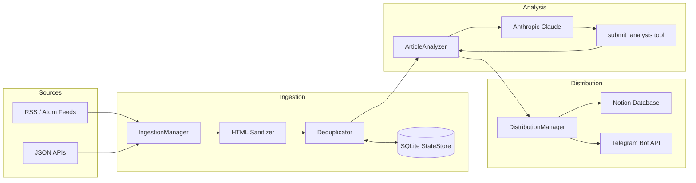

# Market & Trend Intelligence Agent

An autonomous, AI-powered pipeline that continuously ingests market and technology news, analyzes it with Anthropic Claude, and distills high-impact signals into a structured Notion knowledge base and Telegram alerts.


---

## Table of Contents

- [Overview](#overview)
- [Key Features](#key-features)
- [Architecture](#architecture)
- [Tech Stack](#tech-stack)
- [Project Structure](#project-structure)
- [Getting Started](#getting-started)
  - [Prerequisites](#prerequisites)
  - [Installation](#installation)
  - [Configuration](#configuration)
- [Usage](#usage)
- [Notion Setup](#notion-setup)
- [How It Works](#how-it-works)
- [Engineering Decisions](#engineering-decisions)
- [Verification](#verification)
- [Utility Scripts](#utility-scripts)
- [Roadmap](#roadmap)
- [License](#license)

---

## Overview

**Market & Trend Intelligence Agent** is a fully asynchronous Python pipeline that transforms noisy RSS feeds and JSON APIs into a curated stream of market intelligence.

The pipeline has three stages:

1. **Ingestion** – fetch articles from RSS/Atom feeds and JSON endpoints, sanitize HTML, truncate content, and deduplicate across runs.
2. **Analysis** – send each article to Anthropic Claude using **tool calling** and validate the result with **Pydantic v2**.
3. **Distribution** – write structured pages to **Notion** and push high-impact alerts to **Telegram**.

The result is a low-maintenance agent that can be scheduled with cron, GitHub Actions, or any task runner to deliver a daily intelligence digest.

---

## Key Features

- **Structured LLM output via tool calling** – the model is forced to call a `submit_analysis` tool with a JSON schema, eliminating brittle free-form parsing.
- **Strict validation with Pydantic v2** – every analysis is validated for category, impact score, metrics, and summary constraints before distribution.
- **Resilient by design** – exponential backoff with jitter, bounded concurrency, and one automatic correction attempt on validation failure.
- **Persistent deduplication** – SQLite tracks articles across runs and stores an `analyzed_at` marker, so failed analyses are safely retried without losing data.
- **Async distribution** – Notion and Telegram are called concurrently with retries and proper error surfacing.
- **Configurable Notion mapping** – property names are driven by environment variables, and helper scripts keep an existing database in sync.
- **Centralized configuration** – environment-driven settings via `pydantic-settings` with validation and CSV parsing.

---

## Architecture



The entrypoint `main.py` runs the full `ingest → analyze → distribute` pipeline inside a single `asyncio` event loop. Ingestion is synchronous and executed in a worker thread, while analysis and distribution are fully asynchronous.

---

## Tech Stack

| Layer | Technology |
| --- | --- |
| Language | Python 3.11+ |
| Async runtime | `asyncio`, `Semaphore`, `gather` |
| Configuration | `pydantic-settings`, `python-dotenv` |
| HTTP client | `httpx` (sync and async) |
| RSS / Atom parsing | `xml.etree.ElementTree` |
| HTML sanitization | `BeautifulSoup4` |
| LLM provider | Anthropic Claude via `AsyncAnthropic` |
| Structured output | Anthropic tool calling (`submit_analysis`) |
| Schema validation | Pydantic v2 |
| State persistence | SQLite (`sqlite3`) |
| Notion integration | Notion REST API (`/v1/databases`, `/v1/pages`) |
| Telegram integration | Telegram Bot API (`sendMessage`, `MarkdownV2`) |
| Retry strategy | custom exponential backoff with jitter |
| Logging | Python standard `logging` |

---

## Project Structure

```text
market-trend-agent/
├── main.py                     # Async entrypoint: ingest -> analyze -> distribute
├── config.py                   # Pydantic settings and logging configuration
├── ingest.py                   # RSS/JSON ingestion, HTML sanitization, dedup
├── analyzer.py                 # Anthropic async client, tool calling, retries
├── distribute.py               # Notion page creation and Telegram alerts
├── storage.py                  # SQLite StateStore for cross-run dedup
├── models/
│   └── schemas.py              # Pydantic models: ArticleAnalysis, AnalysisFailure
├── create_notion_database.py   # Utility: create a ready-to-use Notion database
├── update_notion_database.py   # Utility: add missing properties to an existing DB
├── list_notion_pages.py        # Utility: list pages shared with the integration
├── requirements.txt
└── README.md
```

---

## Getting Started

### Prerequisites

- Python **3.11+**
- An **Anthropic API key**
- A **Notion integration token** and a target database (optional, but recommended)
- A **Telegram bot token** and chat ID (optional, for alerts)

### Installation

```bash
git clone https://github.com/<your-username>/market-trend-agent.git
cd market-trend-agent

python -m venv .venv

# Windows
.venv\Scripts\activate

# macOS / Linux
source .venv/bin/activate

pip install -r requirements.txt
```

### Configuration

Create a `.env` file in the project root:

```dotenv
# --- Required ---
ANTHROPIC_API_KEY=sk-ant-...
RSS_FEED_URLS=https://rss.arxiv.org/rss/cs.AI,https://www.marktechpost.com/feed/
JSON_ENDPOINT_URLS=https://dev.to/api/articles?per_page=10

# --- Notion (optional) ---
NOTION_API_KEY=ntn_...
NOTION_DATABASE_ID=11112222-3333-4444-5555-666677778888
NOTION_PROP_TITLE=Title
NOTION_PROP_CATEGORY=Category
NOTION_PROP_IMPACT=Impact Score
NOTION_PROP_METRICS=Metrics
NOTION_PROP_URL=URL

# --- Telegram (optional) ---
TELEGRAM_BOT_TOKEN=123456:ABC...
TELEGRAM_CHAT_ID=123456789
TELEGRAM_MIN_IMPACT_SCORE=4

# --- Runtime ---
LOG_LEVEL=INFO
STATE_DB_PATH=market_trend_agent.db
ANALYSIS_CONCURRENCY=4
HTTP_BACKOFF_BASE=1.0
CORRECTION_MAX_ATTEMPTS=1
ANTHROPIC_MODEL=claude-sonnet-4-5-20250929
```

#### Settings reference

| Variable | Default | Required | Description |
| --- | --- | --- | --- |
| `ANTHROPIC_API_KEY` | — | Yes | Anthropic API key. |
| `ANTHROPIC_MODEL` | `claude-sonnet-4-5-20250929` | No | Claude model used for analysis. |
| `RSS_FEED_URLS` | — | No | Comma-separated list of RSS/Atom feed URLs. |
| `JSON_ENDPOINT_URLS` | — | No | Comma-separated list of JSON API endpoints. |
| `NOTION_API_KEY` | — | No | Notion integration token. |
| `NOTION_DATABASE_ID` | — | No | Target Notion database ID. |
| `NOTION_PROP_TITLE` | `Title` | No | Notion title property name. |
| `NOTION_PROP_CATEGORY` | `Category` | No | Notion select property name. |
| `NOTION_PROP_IMPACT` | `Impact Score` | No | Notion number property name. |
| `NOTION_PROP_METRICS` | `Metrics` | No | Notion rich-text property name. |
| `NOTION_PROP_URL` | `URL` | No | Notion URL property name. |
| `TELEGRAM_BOT_TOKEN` | — | No | Telegram bot token. |
| `TELEGRAM_CHAT_ID` | — | No | Telegram chat/channel ID. |
| `TELEGRAM_MIN_IMPACT_SCORE` | `4` | No | Minimum impact score required to send an alert. |
| `STATE_DB_PATH` | `market_trend_agent.db` | No | SQLite path used for cross-run deduplication. |
| `ANALYSIS_CONCURRENCY` | `4` | No | Maximum concurrent Claude requests. |
| `HTTP_BACKOFF_BASE` | `1.0` | No | Base delay in seconds for exponential backoff. |
| `CORRECTION_MAX_ATTEMPTS` | `1` | No | Automatic correction attempts on validation failure. |
| `LOG_LEVEL` | `INFO` | No | Logging level (`DEBUG`, `INFO`, `WARNING`, `ERROR`). |

> **Security:** never commit `.env`. Add it to `.gitignore` and rotate any leaked keys immediately.

---

## Usage

Run the full pipeline:

```bash
python main.py
```

The pipeline will:

1. fetch every configured RSS/JSON source;
2. skip articles that were already analyzed in previous runs;
3. analyze new articles concurrently with Claude;
4. create Notion pages and send Telegram alerts for high-impact items.

Example output:

```text
INFO | ingest | Ingestion complete: 2 unique articles
INFO | analyzer | Analyzed 'Questions? Ask our Hera Space Companion!' | category=AI/LLM | impact=2
INFO | distribute | Created Notion page for 'Questions? Ask our Hera Space Companion!': 3db43f20-...
INFO | __main__ | Pipeline complete | analyzed=2 failures=0 notion=2 telegram=0
```

To force a full re-run, delete the local state database:

```bash
rm market_trend_agent.db
```

---

## Notion Setup

The project ships with three helper scripts that make Notion setup straightforward.

### 1. Create a ready-to-use database

```bash
python create_notion_database.py --parent-page-id <PAGE_ID>
```

The parent page must be shared with your integration. In Notion, open the page and use **Share → Connections** to add the integration.

### 2. Update an existing database

If you already have a database, add the missing properties in place:

```bash
python update_notion_database.py
```

The script renames the title property to `Title` and adds:

| Property | Type |
| --- | --- |
| `Title` | `title` |
| `Category` | `select` |
| `Impact Score` | `number` |
| `Metrics` | `rich_text` |
| `URL` | `url` |

### 3. Inspect accessible pages

```bash
python list_notion_pages.py
```

This lists every page shared with the integration, which is useful when creating a new database.

---

## How It Works

### 1. Ingestion

`IngestionManager` performs a synchronous fetch of every configured source:

- RSS/Atom is parsed with `xml.etree.ElementTree`.
- JSON endpoints are parsed generically, supporting keys such as `items`, `articles`, `posts`, `entries`, `results`, `data`, `news`.
- HTML is sanitized with `BeautifulSoup4`; scripts, styles, iframes, and comments are removed.
- Content is truncated to a configurable word limit (`MAX_WORDS`, default `2000`).
- Every article is hashed by URL (or title as fallback) and checked against the SQLite `StateStore`.

### 2. Analysis

`ArticleAnalyzer` calls Anthropic Claude with a strict system prompt and a single tool, `submit_analysis`. Tool calling guarantees a JSON payload matching the `ArticleAnalysis` schema:

```json
{
  "title": "...",
  "url": "...",
  "category": "AI/LLM | Macro/VC | Competitor Move | Infrastructure | Irrelevant",
  "impact_score": 1,
  "metrics_extracted": "...",
  "summary_markdown": "- ..."
}
```

If validation fails, the analyzer automatically requests one correction with explicit validation errors.

### 3. Distribution

`DistributionManager`:

- builds Notion page properties from the configured `NOTION_PROP_*` names;
- surfaces the raw Notion error body on HTTP 4xx so schema mismatches are easy to diagnose;
- ships with `update_notion_database.py` to add missing properties to an existing database;
- sends Telegram alerts in `MarkdownV2` format when `impact_score >= TELEGRAM_MIN_IMPACT_SCORE`.

---

## Engineering Decisions

- **Tool calling over free-form JSON** – removes fragile regex extraction and guarantees schema compliance.
- **Bounded concurrency** – `asyncio.Semaphore` protects upstream APIs while keeping throughput high.
- **Exponential backoff with jitter** – prevents thundering herd on rate limits and transient 5xx errors.
- **Persistent deduplication with `analyzed_at`** – articles are skipped only after a successful analysis, so failures are never lost.
- **Soft schema validation** – long `summary_markdown` values are truncated rather than rejected, avoiding expensive correction loops.
- **Configurable Notion mapping** – column names are environment-driven, with helper scripts for schema alignment.
- **Environment-driven configuration** – all runtime behavior is configurable without code changes.

---

## Verification

Static checks:

```bash
python -m py_compile main.py analyzer.py distribute.py ingest.py config.py models/schemas.py storage.py
python -c "import main, analyzer, distribute, ingest, storage; print('imports OK')"
```

End-to-end verification:

```bash
python main.py
```

A successful run finishes with:

```text
Pipeline complete | analyzed=<n> failures=<m> notion=<n> telegram=<m>
```

---

## Utility Scripts

| Script | Purpose |
| --- | --- |
| `create_notion_database.py` | Create a new Notion database with the expected schema. |
| `update_notion_database.py` | Add missing properties to an existing Notion database. |
| `list_notion_pages.py` | List pages shared with the Notion integration. |

---

## Roadmap

- Add a `pytest` test suite covering ingestion, schema validation, analyzer retries, and distribution.
- Add Docker support and a GitHub Actions workflow for scheduled runs.
- Add support for more notification channels (Slack, Discord, email).
- Add a web dashboard for browsing the aggregated intelligence.

---

## License

This project is licensed under the MIT License. Add a `LICENSE` file to match the badge above.
